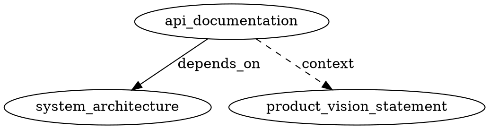

# DOC_DEPENDENCY_SPEC — Specyfikacja zależności dokumentów

## Wersja

`v1.0.0`

## Typy relacji

### 1. `depends_on` — Zależność twarda (hard dependency)

Dokument **wymaga** istnienia i gotowości dokumentów z listy `depends_on` zanim może zostać ukończony.

- **Semantyka:** "Ten dokument nie może być `approved`/`published` dopóki wszystkie dokumenty z `depends_on` nie mają statusu >= `approved`."
- **Wpływ na graf:** Tworzy krawędź skierowaną w DAG (Directed Acyclic Graph).
- **Walidacja:** System wykrywa i blokuje cykle.

```yaml
depends_on:
  - "functional_requirements_specification_frs"
  - "system_architecture"
```

**Reguły:**
- Każdy wpis to `doc_id` istniejącego dokumentu.
- System waliduje istnienie referencji przy skanowaniu.
- Brakujące referencje generują błąd (nie ostrzeżenie).
- Cykle generują błąd krytyczny.

### 2. `context_sources` — Zależność miękka (soft dependency)

Dokument **korzysta z kontekstu** dostarczanego przez inne dokumenty, ale nie wymaga ich gotowości.

- **Semantyka:** "Te dokumenty dostarczają przydatny kontekst, ale nie blokują pracy."
- **Wpływ na graf:** Tworzy krawędź informacyjną (nie blokującą).
- **Walidacja:** Brakujące referencje generują ostrzeżenie (nie błąd).

```yaml
context_sources:
  - "product_vision_statement"
  - "market_analysis"
```

**Reguły:**
- Każdy wpis to `doc_id` istniejącego lub planowanego dokumentu.
- Brakujące referencje logowane jako ostrzeżenie.
- Nie wpływa na blokowanie statusów.

## Model grafu

```
A --depends_on--> B     (A wymaga B, krawędź twarda)
A --context-----> C     (A korzysta z C, krawędź miękka)
```

### Właściwości grafu

1. **DAG** — graf `depends_on` musi być acykliczny.
2. **Context może mieć cykle** — `context_sources` nie podlega walidacji cykli.
3. **Sortowanie topologiczne** — na podstawie `depends_on` wyznaczamy kolejność przetwarzania.
4. **Komponenty spójne** — dokumenty bez zależności tworzą niezależne komponenty.

## Operacje na grafie

### Sortowanie topologiczne

Wyznacza kolejność, w jakiej dokumenty powinny być przetwarzane/weryfikowane:

```
1. Dokumenty bez depends_on (liście)
2. Dokumenty zależne od liści
3. ...rekurencyjnie
```

### Wykrywanie cykli

Algorytm DFS z kolorowaniem (white/gray/black). Cykl wykryty = błąd krytyczny z listą dokumentów w cyklu.

### Analiza wpływu (impact analysis)

Dla danego `doc_id` X:
- **Downstream:** dokumenty, których `depends_on` zawiera X (co się zepsuje jak zmienisz X).
- **Upstream:** dokumenty z `depends_on` X (co X wymaga).

## Formaty wyjściowe

### JSON (graf)

```json
{
  "nodes": [
    {"id": "api_documentation", "type": "specification", "status": "draft"},
    {"id": "system_architecture", "type": "specification", "status": "approved"}
  ],
  "edges": [
    {"from": "api_documentation", "to": "system_architecture", "type": "depends_on"},
    {"from": "api_documentation", "to": "product_vision_statement", "type": "context"}
  ]
}
```

### Dot (Graphviz)



## Reguły integralności

| Reguła | Poziom | Opis |
|--------|--------|------|
| REF_EXISTS | ERROR | Każdy `doc_id` w `depends_on` musi istnieć |
| NO_CYCLE | ERROR | Graf `depends_on` nie może mieć cykli |
| CTX_EXISTS | WARN | Każdy `doc_id` w `context_sources` powinien istnieć |
| NO_SELF_REF | ERROR | Dokument nie może zależeć od siebie |
| STATUS_GATE | WARN | Dokument nie powinien być `approved` jeśli zależności nie są `approved` |
